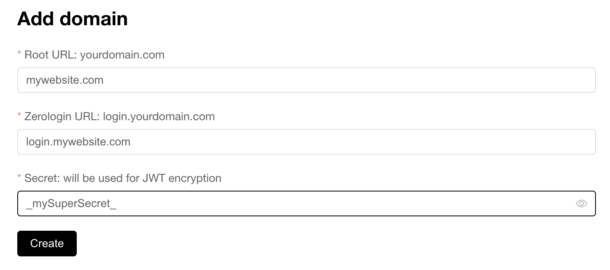

# Backend - configuration

> This guide is assuming your are using the [zerologin.co](https://zerologin.co) instance. Replace all occurence of `zerologin.co` with the Zerologin instance you want to use.

> Also, this guide as assuming your website is `mywebsite.com`

## Configure your DNS

Before adding a domain on Zerologin, you must chose a subdomain add a DNS configuration for this subdomain.

This subdomain will be used as authentication server. For example `login.mywebsite.com`

>⚠️ You should carefully choose which subdomain will be used as LNURL-auth endpoint and stick to chosen subdomain in future. For example, if auth.site.com was initially chosen then changing it to, say, login.site.com will result in a different account for each user because the full domain name is used by wallets as material for key derivation.

Go to your DNS zone and add a CNAME for your subdomain `login`

```
login CNAME zerologin.co.
```
Now wait for the DNS propagation (it can take some time depending of your DNS provider). When it's done, your subdomain [https://login.mywebsite.com](https://login.mywebsite.com) should be pointing to `zerologin.co`

**⚠️ If you are using your own Zerologin instance, please follow this step instead of the step above**

Configure your Zerologin DNS like all your other websites. Example
```
login CNAME zerologin.your-provider.com.
```
or
```
login A 123.123.123.123
```

In any case, your subdomain `login.mywebsite.com` should be pointing to an instance of Zerologin according to your choice

## Add your domain

Login to [zerologin.co](https://zerologin.co/login) (or your Zerologin instance). If it's the first time you logging in, an account will be automatically created.

Once logged in, access to your [dashboard](https://zerologin.co/account). This is where you can add your domain.

There are 3 fields.
- `Root URL` is your main domain name where you have your website
- `Zerologin URL` is your subdomain previously configured (login.mywebsite.com)
- `Secret` is the string used to encrypt and verify your JWT. Choose a strong one.



### mywebsite.com backend

JWT token is stored in the user cookies under the name `jwt` and should be provided on each request.

In your backend, you have the responsability to verify the JWT signature.

Once the JWT is verified, you can use the payload to get the user public key

```json
{
    "payload":{
        "pubKey":"03433c753....2573c093350ee",
        "iat":1653582760,
        "exp":1653589960
    },
    "protectedHeader":{
        "alg":"HS256"
    }
}
```