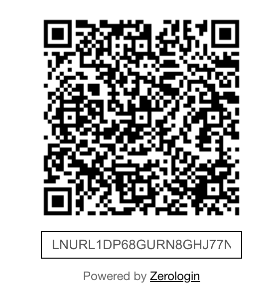

# Frontend - configuration

## Installation

Now your domain name is configured, you can easily add the Zerologin module to your website.

Install dependencies

```
npm install @zerologin/elements
```

## React

```jsx
import '@zerologin/elements'

function Zerologin() {
    const ref = useRef(null);

    const success = (res) => {
        // Login success
        console.log(res.detail)
    }

    const error = (err) => {
        // Login error
        console.log(err.detail)
    }

    useEffect(() => {
        const { current } = ref;
        current?.addEventListener("success", success);
        return () => current?.removeEventListener("success", success);
    }, []);

    useEffect(() => {
        const { current } = ref;
        current?.addEventListener("error", error);
        return () => current?.removeEventListener("error", error);
    }, []);

    <zerologin-auth
        ref={ref}
        url="https://login.mywebsite.com"
        public-id="0a1b66db-...-74a8e6e136a6"
        success={success}
        error={error}
    />
}

export default Zerologin
```

## Vue

### Register custom element

```js
// vite.config.js
import vue from '@vitejs/plugin-vue'
export default {
  plugins: [
    vue({
      template: {
        compilerOptions: {
          isCustomElement: (tag) => tag === "zerologin-auth"
        }
      }
    })
  ]
}
```

```js
// zerologin.vue
<template>
  <div>
    <zerologin-auth 
        url="https://login.mywebsite.com" 
        public-id="0a1b66db-...-74a8e6e136a6"
        @success="success"
        @error="error" />
  </div>
</template>

<script setup>
import '@zerologin/elements'
const success = (res) => {
    // Login success
    console.log(res.detail)
}

const error = (err) => {
    // Login error
    console.log(err.detail)
}
</script>
```

## Conclusion

That's all for the frontend part. You website should display the Zerologin module as follow


On successful login 2 cookies will be added. 
`jwt` contains a JWT encrypted with your secret previously configured using `HS256` algorithm.
`refresh_token` contains the refresh token associated to your JWT.

Cookie will be available for your toplevel domain and all subdomains. The cookie secure flag is set, so your services must run over https.

You can now verify the JWT signature using your secret to authorize/unauthorize and identify your users.